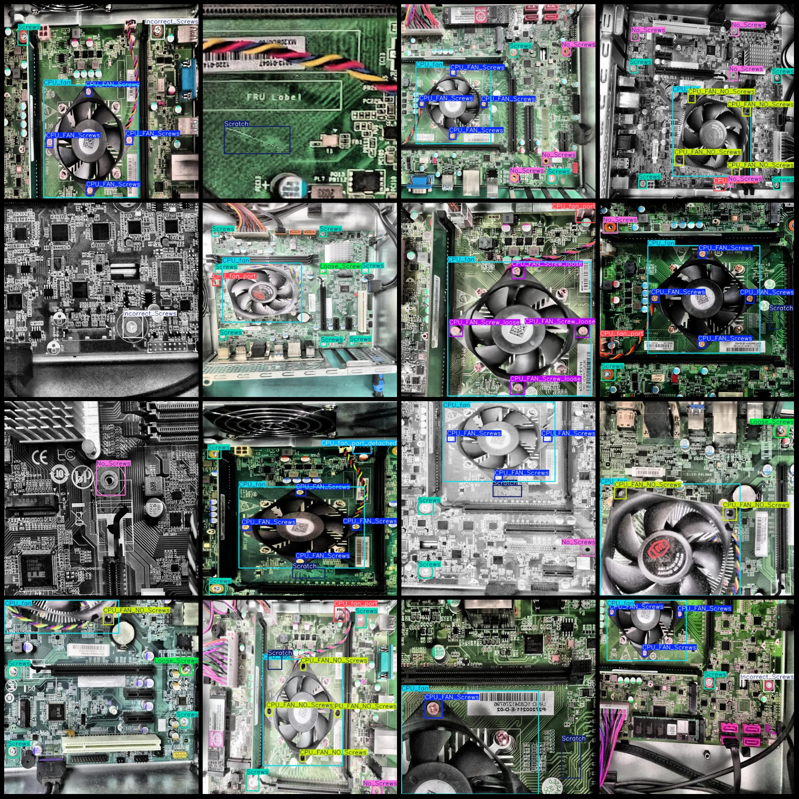
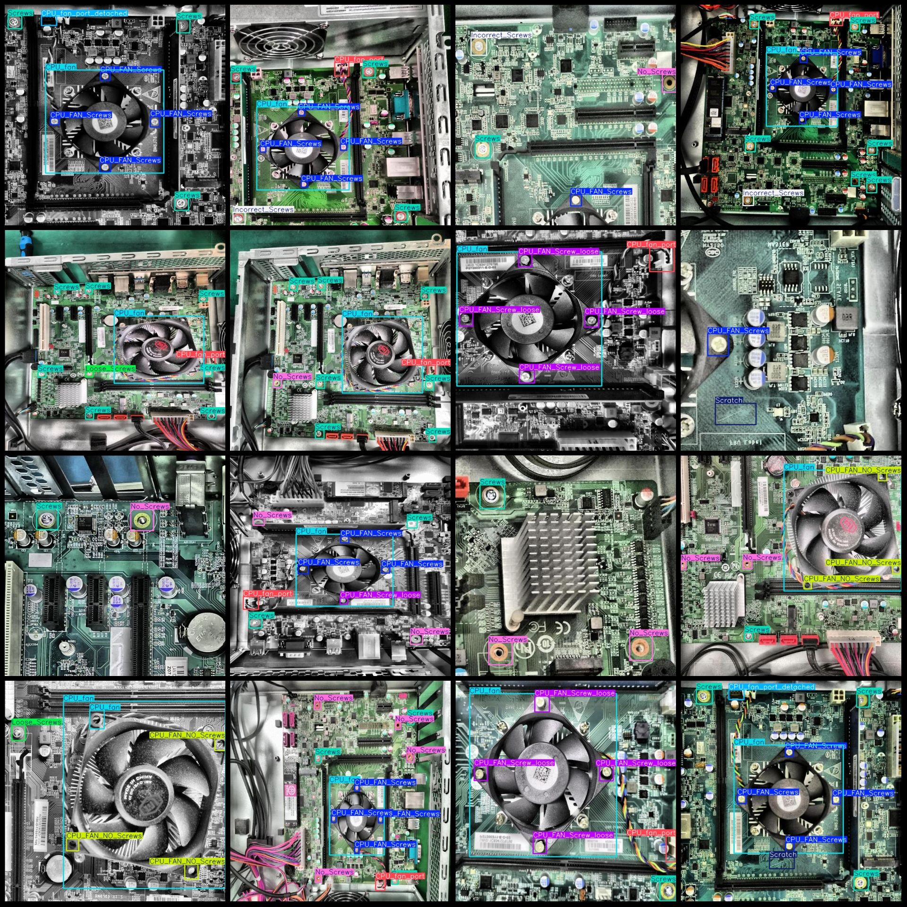

# Computer Motherboard Defects Detection Dataset in VOC+YOLO format with 1014 images and 11 classes

Dataset format: Pascal VOC format+YOLO format (without split path in txtfile, just include jpgimage and corresponding VOC format xmlfile and yolo format txtfile)
number of images: 1014  
The number of XML files is 1014.
annotation count: 1014  
annotationnumber of classes: 11  
Annotation class names: ["CPU_FAN_NO_Screws", "CPU_FAN_Screw_loose", "CPU_FAN_Screws", "CPU_fan", "CPU_fan_port", "CPU_fan_port_detached", "Incorrect_Screws", "Loose_Screws"]
"No_Screws","Scratch","Screws"]  
boxes per class:   
CPU_FAN_NO_Screws(CPU fan - No screws) box count = 853, images = 303
CPU_FAN_Screw_loose(CPU fan - Screw loose) box count = 263, images = 129
The number of CPU fan-with-screws (CPU Fan with Screws) frames is 1807 and the number of images occupied is 556.
The number of CPU_fan boxes is 814, and the number of occupied images is 811.
The CPU_fan_port box count is 410, and there are 410 images.
CPU_fan_port_detachedbox count = 151，images = 148
Incorrect_Screwsbox count = 173，images = 173
Loose_Screwsbox count = 166，images = 166
No_Screwsbox count = 491，images = 372
Scratchbox count = 250，images = 250
Screw box count = 2054, images = 701
total boxes: 7432  
image resolution: 640x640  
Use the annotation tool: labelImg.
Annotation rule: draw a rectangle around the class.
Important Note: The dataset is not split into training, validation, and test sets; you will need to do that yourself.
Special Notice: This dataset does not guarantee the accuracy of the trained model or the weights file.
Image Preview:
## Images

Here is a pay link on Stripe ( https://buy.stripe.com/3cs8yP7sY87d0vu9AB ). Please contact me lonlonago@foxmail.com after funding $89, and I will send you a complete data files , thank you!

